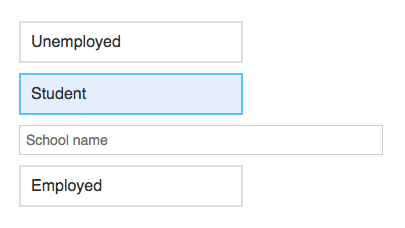

# Week 2

This week we will begin our journey by looking at some of the complexities related to user interface programming, and how React removes some of these obstacles.

## Monday

Today we will talk about the complexity of developing user interfaces. We will do this by creating a small user interfaces in three different versions: One in pure JavaScript and HTML, one with a slightly different approach in JavaScript, and then in React. These three examples are below, and the problems associated to each approach can be found in their README's.

### A UI Complexity Problem

This is the user interface that we will build. It has three buttons, and two input fields that toggle depending on the users' selections.

1. **[ui-complexity-dom-manipulation](ui-complexity-dom-manipulation)**. A simple user interface written in pure JavaScript. Please consult the README.

1. **[ui-complexity-render-function](ui-complexity-render-function)**. The same user interface written to render HTML elements in JavaScript. Please consult the README.

### Solving it with React

We will now code this interface in React using a lot of techniques that will seem unfamiliar. We will discuss these things in the coming weeks. For now, it's just a matter of understanding what React _does_.

1. **[ui-complexity-react](ui-complexity-react)**. The same user interface written in React. Please consult the README.

### In-Class Exercise

Let's install and create a React app together using `create-react-app`.

## Wednesday

Today we will look at the most important concepts when programming in React.

1. **[components](components)**. This demonstrates the basic functionality of a React component. Please consult the README.

1. **[jsx](jsx)**. This takes a deeper look at the JSX syntax that makes React components so powerful.
